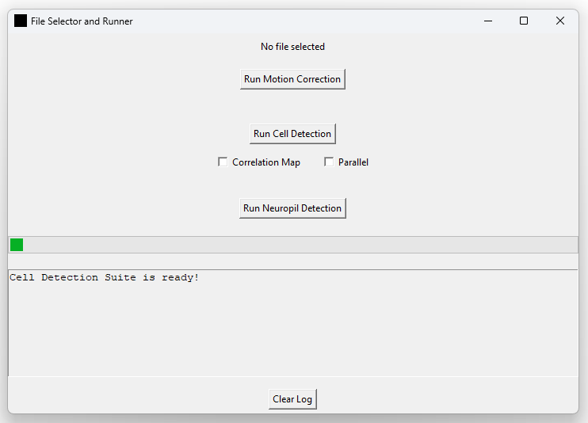

# Cell Detection Suite

Welcome to the *Cell Detection Suite*.  
A simple GUI wrapped around CAIMAN for easy motion correction and cell detection.

---

## Installation

### 1. Get Miniforge or Similar

Download Miniforge from:

[https://github.com/conda-forge/miniforge](https://github.com/conda-forge/miniforge)  
See the "Install" section there.

---

### 2. Create a New Environment and Install CAIMAN

You can also refer to:  
- [Caiman Installation Docs](https://caiman.readthedocs.io/en/latest/Installation.html)  
- [Caiman GitHub](https://github.com/flatironinstitute/CaImAn)

Open a Miniforge terminal (or similar) and run:

```bash
mamba create -n caiman -c conda-forge -c anaconda caiman
```

Or, if using `conda`:

```bash
conda create -n caiman -c conda-forge -c anaconda caiman
```

This will take some time to download and install.

Than activate your new env:

```bash
conda activate caiman
```

---

### 3. Install Demos and Models

After installation, run:

```bash
caimanmanager install
```

If this completes successfully, CAIMAN should now be installed.

---

### 4. Install Some Additional Packages

You need one more packages to handle tiff files:

Using `conda`:

```bash
conda install tifffile
```

Or with `pip`:

```bash
conda install pip
pip install tifffile
```

---

### 5. Cell Detection Suite GUI

Save the following files to a folder on your disk:
- `run_caiman.py`
- `caiman_config.py`

Then, open a terminal (e.g., Miniforge) and navigate to the folder:

```bash
cd C:/path/to/files/
```

Now run the Python file:

```bash
python run_caiman.py
```

This should start the GUI. It may take some time to appear, as it needs to import CAIMAN.

### How to use the GUI
Start a terminal and activate your caiman environment, then run the python file:
```bash
conda activate caiman
cd C:/path/to/files/
python run_caiman.py
```



#### Motion Correction
To run the caiman motion correction on a multi-paged tiff file (your recording) press the "Run Motion Correction" Button.
It will ask you to select a file. You can follow the progress in the Log Panel at the bottom. The motion corrected file
will be stored in the same directory as your original recording ("motion_corrected_you_file").
So far the settings are hard coded in the "run_caiman.py" file. In future version there will be an additional settings
file, as well.

#### Cell Detection and Source Extraction
To run the caiman automated cell detection and source extractions (signals) press the "Run Cell Detection" Button.
It will ask you to select a file. You can follow the progress in the Log Panel at the bottom. The resulting data files
and figures will be stored in the same directory as your original recording into a folder called "caiman_output".

Options:
Correlation map: if checked it will compute a 8-neighbour pixel-wise correlation map of activity. This is only used for
visualization later on. Beware that this can be quite demanding on your computer (performance-wise).

Parallel: if checked it will use the parallel processing method in caiman

Settings:
Settings can be changed in the "caiman_config.py". It is essential just a dictionary containing the basic settings for
caiman. Just open this file in any editor and make some changes. Save it and restart the "cell_detection_suite".
For more information see the caiman docs (https://caiman.readthedocs.io/en/latest/).

> **Important:**  
> The `caiman_config.py` file must always be in the same directory as `run_caiman.py`.

**Output files:**

All results in a python and caiman readable hdf5 file
- cnmf_full_pipeline_results.hdf5

The Fluorescence Traces of all the accepted and rejected cells can be found in (each column is a cell):
- caiman_accepted_ca_traces.csv
- caiman_rejected_ca_traces.csv

The location of the cells in pixel can be found in:
- caiman_accepted_roi_centers.csv
- caiman_rejected_roi_centers.csv

Figures to visualize the results:
- caiman_mean_img_contour_plot.jpg (shows the contours of the accepted and rejected cell)
- caiman_mean_img_rois_center.jpg (shows center of all rois)
- caiman_accepted_mean_img_rois_center.jpg (shows center of all accepted rois)


#### Area Detection (e.g. neuropil)
You can create a mask (ROI) in ImageJ (https://imagej.net/software/fiji/downloads) and export it as a .roi file.
After you successfully run the cell detection (caiman) you can separate all your detected cells as being part of that
region or not. This can be helpful if you want to exclude or separate certain areas (e.g. neuropil and cell bodies).

**Output files:**

- inside_caiman_ca_traces.csv
- outside_caiman_ca_traces.csv
- inside_caiman_roi_centers.csv
- outside_caiman_roi_centers.csv
- area_detection.jpg

### References
The "cell_detection_suite" is based on the CAIMAN package. For more information see:

- https://caiman.readthedocs.io/en/latest/
- https://github.com/flatironinstitute/CaImAn

[Giovannucci, Andrea, et al. "CaImAn an open source tool for scalable calcium imaging data analysis." elife 8 (2019): e38173]( https://doi.org/10.7554/eLife.38173 )

          
    
---
### ----------  
Nils Brehm - 2025